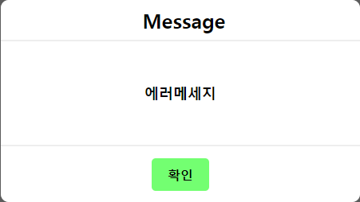
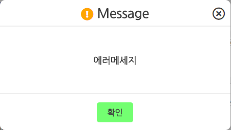

# flex_popup
IE / chrome 중앙정렬 팝업

### [CSS] flex css적용
style .popupWrap에 적용되어있는 부분이 중요하다.<br/>
기존에 flex라는 CSS를 알게 된 후 적용했을때 chrome에서는 이상없이 잘 동작한다. <br/>
```
<style>
	.popupWrap{display:flex; align-items:center; justify-content:center; width:100%; height: 100%; position:fixed;}
	.popup{width:150px; height:150px;}
</style>
```
하지만 위의 style만 적용하면 chrome에서는 잘 동작하는데 IE 11에서는 깨진다.(다른 IE버전은 확인해보지 못했다.)<br/><br/>

찾아보니 IE에서도 정상 동작하게 해주는 style이 있었다.<br/>
**참고한 페이지 : [https://codepen.io/frontendj/pen/Xbvvgg](https://codepen.io/frontendj/pen/Xbvvgg);**
```
<style>
	.popupWrap{display: -ms-flexbox; display: flex; -ms-flex-pack: center; justify-content: center; -ms-flex-align: center; align-items: center;-ms-flex-direction: column; flex-direction: column; width:100%; height: 100%; position:fixed;}
	.popup{width:150px; height:150px;}
</style>
```

# Example
fontawesome을 여기에 업로드하지는 않았다. <i></i>태그는 신경쓰지 않아도 된다. 확인하고 싶다면 fontawesome 다운로드 후 적용하면 정확한 화면을 볼 수 있다.
```
<!DOCTYPE html>
<html>
    <head>
        <style type="text/css">
            *{margin:0; padding:0;}
            .popupWrap{display: -ms-flexbox; display: flex; -ms-flex-pack: center; justify-content: center; -ms-flex-align: center; align-items: center;-ms-flex-direction: column; flex-direction: column;position: fixed; align-content: center; background:rgba(0, 0, 0, 0.4); z-index:3; width:100%; height:100%;}
            .popupWrap2{background: lightgray; display: -ms-flexbox; display: flex; -ms-flex-pack: center; justify-content: center; -ms-flex-align: center; align-items: center; -ms-flex-direction: column; flex-direction: column;position: fixed; align-content: center; background:rgba(0, 0, 0, 0.4); z-index:3; width:100%; height:100%;}
            .popup{background:white; width:450px; border-radius: 10px 10px 10px 10px;}
            .popupCloseCell{width:100%; height: 50px; position: relative; display: -ms-flexbox; display: flex; -ms-flex-pack: center; justify-content: center; -ms-flex-align: center; align-items: center; -ms-flex-direction: column; flex-direction: column; border-bottom:2px solid #eee;}
            .popupCloseCell div{font-size: 25px;}
            .popupCloseCell div:first-child i{vertical-align: middle; color:orange;}
            .popupCloseCell div:last-child{position:absolute; right:10px; top:13px;}
            .popupCloseCell div:last-child i:hover{cursor:pointer;}
            .popupContentCell{width:100%; height: 130px; border-bottom:2px solid #eee; display: -ms-flexbox; display: flex; -ms-flex-pack: center; justify-content: center; -ms-flex-align: center; align-items: center; -ms-flex-direction: column; flex-direction: column;}
            .popupContentCell2{width:100%; height: 130px; border-bottom:2px solid #eee;display: -ms-flexbox; display: flex; -ms-flex-pack: center; justify-content: center; -ms-flex-align: center; align-items: center; -ms-flex-direction: column; flex-direction: column;}
            .popupContentMsg{width: 400px; text-align:center;}
            .popupContentMsg2{width: 400px; text-align:center;}
            .popupContentMsg p{text-align:center;font-size: 20px;font-weight:bold;white-space: normal; line-height: 1.2; word-wrap: break-word; display: -webkit-box; -webkit-line-clamp: 3; -webkit-box-orient: vertical; overflow: hidden;}
            .popupContentMsg2 p{text-align:center;font-size: 18px;font-weight:bold;white-space: normal; line-height: 1.2; word-wrap: break-word; display: -webkit-box; -webkit-line-clamp: 3; -webkit-box-orient: vertical; overflow: hidden;}
            .popupBotCell{width:100%; height: 70px; display:flex; align-items: center; justify-content: center;}
            .popupBotCell div{padding: 10px 20px; border-radius: 5px 5px 5px 5px; font-weight: bold;}
            .popupBotCell div:hover{cursor:pointer;}
            .popupOkBtn{background:#73ff71;}
            .popupOkBtn:hover{background:#c4ffc4;box-shadow: 0 0px 8px 3px #73ff71;}
            .popupOkBtn2{background:#73ff71;}
            .popupOkBtn2:hover{background:#c4ffc4;box-shadow: 0 0px 8px 3px #73ff71;}
            .popupCancelBtn{background:powderblue;}
            .popupCancelBtn:hover{background:#dbfbff; box-shadow: 0 0px 8px 3px powderblue;}
        </style>
    </head>
    <body>
        <div class="popupWrap disNone">
            <div class="popup">
                <div class="popupCloseCell">
                    <div><b><i class="fas fa-exclamation-circle"></i>&nbsp;Message</b></div>
                    <div class="popupCloseBtn"><i class="far fa-times-circle"></i></div>
                </div>
                <div class="popupContentCell">
                    <div class="popupContentMsg"><p>에러메세지</p></div>
                </div>
                <div class="popupBotCell">
                    <div class="popupOkBtn">확인</div>
                    <span>&nbsp;&nbsp;&nbsp;</span>
                    <div class="popupCancelBtn">취소</div>
                </div>
            </div>
        </div>
        <div class="popupWrap2 disNone">
            <div class="popup">
                <div class="popupCloseCell">
                    <div><b><i class="fas fa-exclamation-circle"></i>&nbsp;Message</b></div>
                    <div class="popupCloseBtn2"><i class="far fa-times-circle"></i></div>
                </div>
                <div class="popupContentCell2">
                    <div class="popupContentMsg2"><p>에러메세지</p></div>
                </div>
                <div class="popupBotCell">
                    <div class="popupOkBtn2">확인</div>
                </div>
            </div>
        </div>
    </body>
</html>
```

## 미리보기
### fontawesome 적용 전

### fontawesome 적용 후


